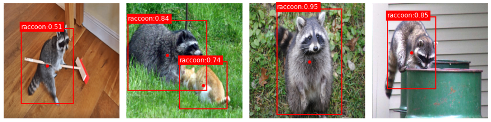
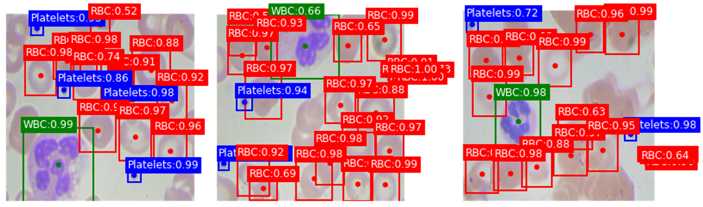

# tf2_YOLO

  

YOLO, you only look once, wait...are you sure about that??

The truth may be that the model only look once, but you implemented it and tried it thousands of times.

Before you go crazy, you must try this repo.

**tf2_YOLO** is my implementation of YOLOv1 to YOLOv3 using Tensorflow 2.X after delving into 3 papers of YOLO:

**YOLOv1**: You Only Look Once: Unified, Real-Time Object Detection by Joseph Redmon, Santosh Divvala, Ross Girshick, Ali Farhadi (https://arxiv.org/abs/1506.02640).

**YOLOv2(YOLO9000)**: Better, Faster, Stronger by Joseph Redmon, Ali Farhadi (https://arxiv.org/abs/1612.08242).

**YOLOv3**: An Incremental Improvement by Joseph Redmon, Ali Farhadi (https://arxiv.org/abs/1804.02767).

This repo refers to lots of resources, including the source code of darknet:

- https://github.com/qqwweee/keras-yolo3
- https://github.com/allanzelener/YAD2K
- https://github.com/penny4860/Yolo-digit-detector
- https://github.com/pjreddie/darknet

Most importantly, the repo is written in Python and Tensorflow, so you can easily modify anything in it and program comfortably.

# Table of Contents

- [tf2_YOLO](#tf2_yolo)
- [Table of Contents](#table-of-contents)
- [Installation](#installation)
- [Sample applications](#sample-applications)
  - [Raccoon detection](#raccoon-detection)
  - [Blood cell detection](#blood-cell-detection)
- [Usage](#usage)
  - [1. Create YOLO class](#1-create-yolo-class)
  - [2. Read file](#2-read-file)
  - [3. Visualize one of images with its annotation](#3-visualize-one-of-images-with-its-annotation)
  - [4. Get anchor boxes for yolov2 and yolov3](#4-get-anchor-boxes-for-yolov2-and-yolov3)
  - [5. Create model](#5-create-model)
  - [6. Compile model](#6-compile-model)
  - [7. Train model](#7-train-model)
  - [8. Predict and Evaluate](#8-predict-and-evaluate)
  - [9. Get PR curve and mAP](#9-get-pr-curve-and-map)

# Installation

1. Clone or download
    - Use the command bellow in terminal to git clone:    
    ```git clone https://github.com/samson6460/tf2_YOLO.git```

    - Or just download whole files using the **[Code > Download ZIP]** button in the upper right corner.
    
2. Install dependent packages: 
    ```pip install -r requirements.txt```

# Sample applications

## Raccoon detection



[Open sample code in Colab](https://colab.research.google.com/drive/1c-wIrMN9K-ohR4zrPqvGTeot64FIM-le?usp=sharing)

*dataset from: https://github.com/datitran/raccoon_dataset*

## Blood cell detection



[Open sample code in Colab](https://colab.research.google.com/drive/1JKqcdoEHgxqPCLkF7igFv5dRckpE9pDx?usp=sharing)

*dataset from: https://github.com/Shenggan/BCCD_Dataset.git*

# Usage

## 1. Create YOLO class

***YOLOv1***
```
from tf2_YOLO import yolov1_5
yolo = yolov1_5.Yolo(input_shape, class_names)
```

***YOLOv2***
```
from tf2_YOLO import yolov2
yolo = yolov2.Yolo(input_shape, class_names)
```

***YOLOv3***
```
from tf2_YOLO import yolov3
yolo = yolov3.Yolo(input_shape, class_names)
```

- **input_shape**: A tuple of 3 integers, shape of input image.
- **class_names**: A list, containing all label names.

---

## 2. Read file

***Read as array(read into RAM)***
```
img, label = yolo.read_file_to_dataset(
    img_path, 
    label_path)
```
or

***Read as tf.Sequence***
```
seq = yolo.read_file_to_sequence(
    img_path, 
    label_path,
    batch_size)
```

- **img_path**: A string, file path of images.
- **label_path**: A string, file path of annotations.

- **batch_size**: An integer, size of the batches of data (default: 20).

***Returns from YOLOv1、YOLOv2***

A tuple of 2 ndarrays, (img, label),
- shape of img: (batch_size, img_heights, img_widths, channels)
- shape of label: (batch_size, grid_heights, grid_widths, info)

***Returns from YOLOv3***

A tuple: (img: ndarray, label_list: list), label_list contains the label of all FPN layers.
- shape of img: (batch_size, img_heights, img_widths, channels)
- shape of label: (batch_size, grid_heights, grid_widths, info)


---

## 3. Visualize one of images with its annotation

***YOLOv1、YOLOv2***
```
yolo.vis_img(img[0], label[0])
```

***YOLOv3***
```
yolo.vis_img(img[0], label[2][0])
```

---

## 4. Get anchor boxes for yolov2 and yolov3

***YOLOv2***
```
from utils.kmeans import kmeans, iou_dist
import numpy as np

all_boxes = label[label[..., 4] == 1][..., 2:4]
anchors = kmeans(
    all_boxes,
    n_cluster=5,
    dist_func=iou_dist,
    stop_dist=0.00001)
anchors = np.sort(anchors, axis=0)[::-1]
```

***YOLOv3***
```
from utils.kmeans import kmeans, iou_dist
import numpy as np

all_boxes = label[-1][label[-1][..., 4] == 1][..., 2:4]
anchors = kmeans(
    all_boxes,
    n_cluster=9,
    dist_func=iou_dist,
    stop_dist=0.00001)
anchors = np.sort(anchors, axis=0)[::-1]
```

---

## 5. Create model

***YOLOv1***
```
model = yolo.create_model(bbox_num)
```

- **bbox_num**: An integer, the number of bounding boxes.

***YOLOv2、YOLOv3***
```
model = yolo.create_model(anchors)
```

- **anchors**: 2D array like, prior anchor boxes(widths, heights), all the values should be normalize to 0-1.

---

## 6. Compile model

***YOLOv1、YOLOv2***
```
from utils.tools import get_class_weight
from tensorflow.keras.optimizers import Adam

binary_weight = get_class_weight(
    label[..., 4:5],
    method='binary'
    )

loss = yolo.loss(binary_weight)

metrics = yolo.metrics("obj+iou+recall0.5")

yolo.model.compile(optimizer=Adam(lr=1e-4),
                   loss=loss,
                   metrics=metrics)
```

***YOLOv3***
```
from utils.tools import get_class_weight
from tensorflow.keras.optimizers import Adam

binary_weight_list = []

for i in range(len(label)):
    binary_weight_list.append(
        get_class_weight(
        label[i][..., 4:5],
        method='binary'
        )
    )

loss = yolo.loss(binary_weight_list)

metrics = yolo.metrics("obj+iou+recall0.5")

yolo.model.compile(optimizer=Adam(lr=1e-4),
                   loss=loss,
                   metrics=metrics
                   )
```

---

## 7. Train model

***Train with dataset***
```
yolo.model.fit(
    data,
    label,
    epochs)
```

***Train with tf.Sequence***
```
yolo.model.fit(
    seq,
    epochs)
```

## 8. Predict and Evaluate

***YOLOv1、YOLOv2***
```
from utils.measurement import create_score_mat

prediction = yolo.model.predict(data)

yolo.vis_img(
    data[0], prediction[0],
    nms_mode=2)

create_score_mat(
    label,
    prediction,
    class_names=yolo.class_names,
    nms_mode=2,
    version=1 # or version=2
    )
print(create_score_mat)
```

***YOLOv3***
```
from utils.measurement import create_score_mat

prediction = yolo.model.predict(data)

yolo.vis_img(
    data[0],
    prediction[2][0],
    prediction[1][0],
    prediction[0][0],
    nms_mode=2)

create_score_mat(
    label[-1],
    prediction[2],
    prediction[1],
    prediction[0],
    class_names=yolo.class_names,
    nms_mode=2,
    version=3)
print(create_score_mat)
```

- **nms_mode**: An integer,
  - 0: Not use NMS.
  - 1: Use NMS.
  - 2: Use Soft-NMS.
- **version**: An integer, specifying the decode method, yolov1、v2 or v3.

## 9. Get PR curve and mAP

***YOLOv1、YOLOv2***
```
from utils.measurement import PR_func

pr = PR_func(
    label,
    prediction,
    class_names=yolo.class_names,
    max_per_img=100,
    version=1 # or version=2
    )

pr.plot_pr_curve(smooth=False)

pr.get_map(mode="voc2012")
```

***YOLOv3***
```
from utils.measurement import PR_func

pr = PR_func(
    data[-1],
    prediction[2],
    prediction[1],
    prediction[0],
    class_names=yolo.class_names,
    max_per_img=100,
    version=3
    )

pr.plot_pr_curve(smooth=False)

pr.get_map(mode="voc2012")
```

- **max_per_img**: An integer, limit the number of objects that an image can detect at most.
- **version**: An integer, specifying the decode method, yolov1、v2 or v3.
- **smooth**: A boolean, if True, use interpolated precision.
- **mode**: A string, one of "voc2007", "voc2012"(default), "area", "smootharea".
  - "voc2007": calculate the average precision of recalls at [0, 0.1, ..., 1](11 points).
  - "voc2012": calculate the average precision of recalls at [0, 0.14, 0.29, 0.43, 0.57, 0.71, 1].
  - "area": calculate the area under precision-recall curve.
  - "smootharea": calculate the area under interpolated precision-recall curve.